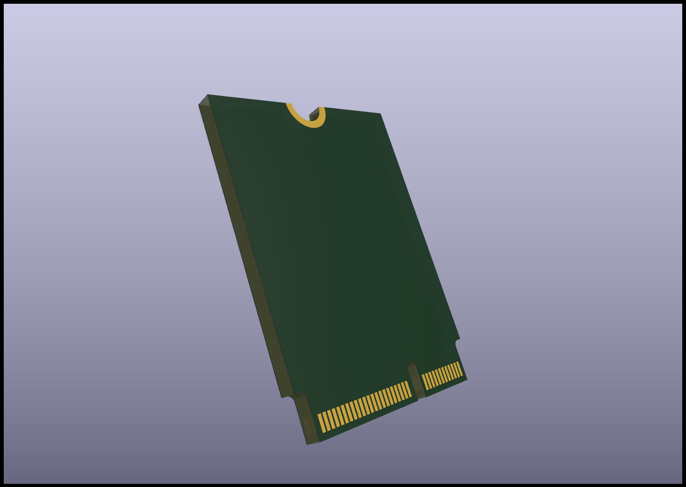
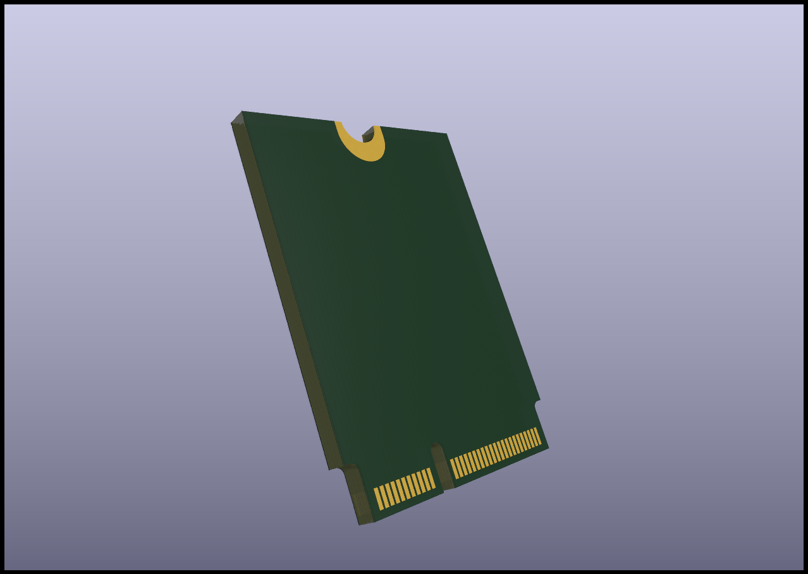
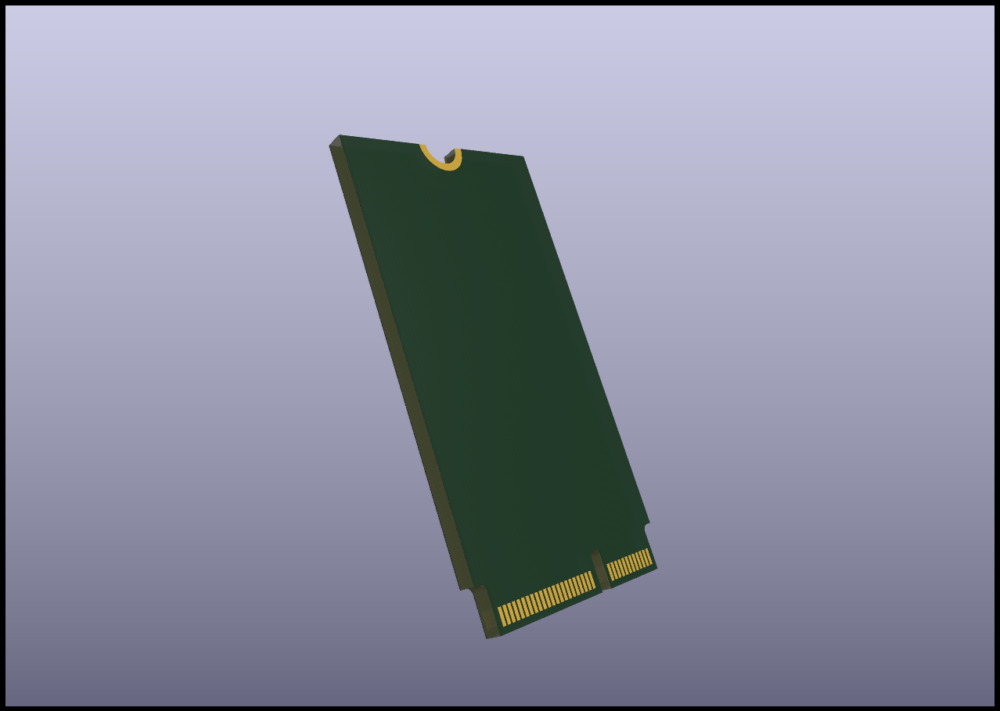
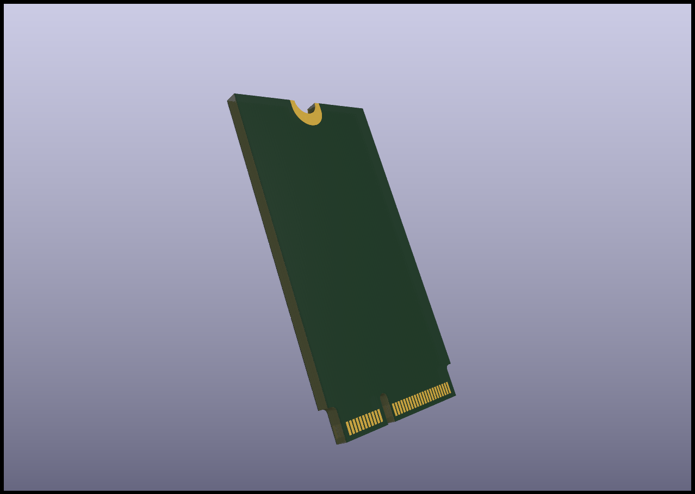

# M.2-Key-E-Footprints

Precise M.2 Key E (2230 and 2242) KiCad footprints, created following the [PCI Express M.2 Electromechanical Specification Revision 1.0](https://web.archive.org/web/20200613074028/http://read.pudn.com/downloads794/doc/project/3133918/PCIe_M.2_Electromechanical_Spec_Rev1.0_Final_11012013_RS_Clean.pdf)

**NOTE: THIS DOES NOT INCLUDE ANTENNA CONNECTOR PLACEMENT, FOR THAT REFER TO THE SPEC**

## 2230 Render

- Front

- Back

## 2242 Render

- Front

- Back
